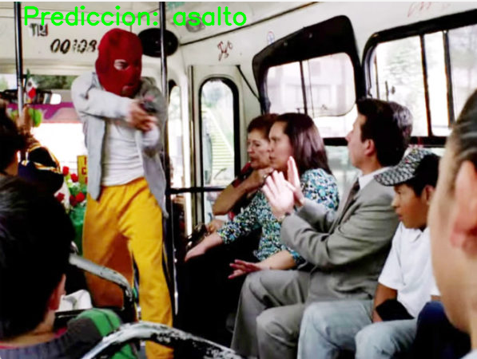

# *Reconocimeito de castrastrofes CNN*

Un CNN, o Red Neuronal Convolucional (Convolutional Neural Network en inglés), es un tipo de red neuronal profunda especialmente diseñada para procesar datos con una estructura en forma de rejilla, como las imágenes. En este caso se trata en modo a generar un DataSet de castrastrofes debemos de tomar varias cosas en cuenta.

La diversidad de las imagenes en diferentes panoramas para una sola catastrofe.
Calidad y tamaño de las imagenes.
Etiqueas de cada imagen.
Procesamiento de datos.

Se creo un data set con diferenciacion de 5 situaciones:

-*Asaltos*
-*Robo Casa habitacion*
-*Inundacion*
-*Tornados*
-*Incendio* 

# Como se entrena #

Primero se cargas las librerias necesarias:

*import numpy as np*
*import os*
*import re*
*import matplotlib.pyplot as plt*
*%matplotlib inline*
*from sklearn.model_selection import train_test_split*
*from sklearn.metrics import classification_report*

*import keras*
*import tensorflow as tf*
*from keras.utils import to_categorical*
*from keras.models import Sequential,Model*
*from keras.layers import Input*
*from keras.layers import Dense, Dropout, Flatten*
*#from keras.layers import Conv2D, MaxPooling2D*
*#from tensorflow.keras.models import Sequential*
*from keras.layers import (*
    *BatchNormalization, SeparableConv2D, MaxPooling2D, Activation, Flatten, Dropout, Dense, Conv2D*
*)*
*from keras.layers import LeakyReLU*

## Ahora se leen las imagenes ##

*dirname = os.path.join(os.getcwd(),'C:\\Users\\Leona\\Downloads\\ProyectoCNN\\ProyectoCNN\\categorias')*
*imgpath = dirname + os.sep* 

*images = []*
*directories = []*
*dircount = []*
*prevRoot=''*
*cant=0*

*print("leyendo imagenes de ",imgpath)*

*for root, dirnames, filenames in os.walk(imgpath):*
    *for filename in filenames:*
        *if re.search("\.(jpg|jpeg|png|bmp|tiff)$", filename):*
            *cant=cant+1*
            *filepath = os.path.join(root, filename)*
            *image = plt.imread(filepath)*
            *if(len(image.shape)==3):*
                *images.append(image)*
            *b = "Leyendo imagen..." + str(cant)*
            *print (b, end="\r")*
            *if prevRoot !=root:*
                *print(root, cant)*
                *prevRoot=root*
                *directories.append(root)*
                *dircount.append(cant)*
                *cant=0*
*dircount.append(cant)*

*dircount = dircount[1:]* 
*dircount[0]=dircount[0]+1*
*print('Directorios leidos:',len(directories))*
*print("Imagenes en cada directorio", dircount)*
*print('suma Total de imagenes en subdirs:',sum(dircount))*

## Ahora a los fotos leidas, se les crea etiquetas dependiendo de la carpeta que fueron leidas ##

*labels=[]*
*indice=0*
*for cantidad in dircount:*
    *for i in range(cantidad):*
        *labels.append(indice)*
    *indice=indice+1*
*print("Cantidad etiquetas creadas: ",len(labels))*

## Creación de DataSet ##

*train_X,test_X,train_Y,test_Y = train_test_split(X,y,test_size=0.2)*
*print('Training data shape : ', train_X.shape, train_Y.shape)*
*print('Testing data shape : ', test_X.shape, test_Y.shape)*

*plt.figure(figsize=[5,5])*

## One-hot Ending para la red ##

*train_Y_one_hot = to_categorical(train_Y)*
*test_Y_one_hot = to_categorical(test_Y)*

*print('Original label:', train_Y[0])*
*print('After conversion to one-hot:', train_Y_one_hot[0])*
*print(len(train_X))*
*print(len(train_Y_one_hot))*

## Creamos el DataSet de Entrenamiento ##

*train_X,valid_X,train_label,valid_label = train_test_split(train_X, train_Y_one_hot, test_size=0.2, random_state=13)*
*print(train_X.shape,valid_X.shape,train_label.shape,valid_label.shape)*

## Creamos el modelo CNN ##

-*INIT_LR = 1e-3 # Valor inicial de learning rate. El valor 1e-3 corresponde con 0.001*
-*epochs = 20 # Cantidad de iteraciones completas al conjunto de imagenes de entrenamiento*
-*batch_size = 64 # cantidad de imágenes que se toman a la vez en memoria*

*sport_model = Sequential()*
*sport_model.add(Conv2D(32, kernel_size=(3, 3),activation='linear',padding='same',input_shape=(28,28,3)))*
*sport_model.add(LeakyReLU(alpha=0.1))*
*sport_model.add(MaxPooling2D((2, 2),padding='same'))*
*sport_model.add(Dropout(0.5))*
*sport_model.add(Flatten())*
*sport_model.add(Dense(32, activation='linear'))*
*sport_model.add(LeakyReLU(alpha=0.1))*
*sport_model.add(Dropout(0.5))*
*sport_model.add(Dense(nClasses, activation='softmax'))*

## Empieza el entrenamiento ##

Este paso durara mucho por los recursos disponibles de cada computadora, por lo que hay que tener paciencia en este paso

*sport_train = sport_model.fit(train_X, train_label, batch_size=batch_size,epochs=epochs,verbose=1,validation_data=(valid_X, valid_label))*

Una vez que se acabe el entrenamiento, hay que guardar la red, ya sea en formato h5 o keras

*sport_model.save("C:\\Users\\Leona\\Documents\\ProyectoCNN\\ProyectoCNN\\categorias\\red.h5")*
*sport_model.save("C:\\Users\\Leona\\Documents\\ProyectoCNN\\ProyectoCNN\\categorias\\red1.keras")*

## Evaluamos la red ##

Ahora evaluamos la red que hemos entrenado:

*test_eval = sport_model.evaluate(test_X, test_Y_one_hot, verbose=1)*

*print('Test loss:', test_eval[0])*
*print('Test accuracy:', test_eval[1])*

*ccuracy = sport_train.history['accuracy']*
*val_accuracy = sport_train.history['val_accuracy']*
*loss = sport_train.history['loss']*
*val_loss = sport_train.history['val_loss']*
*epochs = range(len(accuracy))*
*plt.plot(epochs, accuracy, 'bo', label='Training accuracy')*
*plt.plot(epochs, val_accuracy, 'b', label='Validation accuracy')*
*plt.title('Training and validation accuracy')*
*plt.legend()*
*plt.figure()*
*plt.plot(epochs, loss, 'bo', label='Training loss')*
*plt.plot(epochs, val_loss, 'b', label='Validation loss')*
*plt.title('Training and validation loss')*
*plt.legend()*
*plt.show()*

Esto nos genera una curva de evaluacion, tanto la acertividad del entrenamiento como lo malo.

*predicted_classes=[]*
*for predicted_sport in predicted_classes2:*
    *predicted_classes.append(predicted_sport.tolist().index(max(predicted_sport)))*
*predicted_classes=np.array(predicted_classes)*

# Ahora si viene lo bueno #

Lo siguiente sera correr el codigo que toma nuestro archivo h5 (en este caso) que es nuestro modelo

*sport_model = load_model('C:\\Users\\Leona\\Downloads\\ProyectoCNN\\ProyectoCNN\\categorias\\red.h5')  # Sustituye con la ruta a tu modelo*

*filenames = ['C:\\Users\\Leona\\Documents\\EJ3\\CCN-PRUEBAS\\inundacion3.jpg']*

# Resultados#

Estos son los siguientes ejemplos que han salido a base del modelo:

Este es un ejemplo de la identificación de la situación, la cual es un asalto

Este es un ejemplo de una inundación.

Este es un ejemplo de un asalto.

Hablando de temas generales, la clasificación de desastres puede ser muy beneficioso en varios aspectos relacionados con la gestión y respuesta a estos eventos (mencionando un ejemplo). Ya sea la deteccion temprana como monitoreo, evaluacion de daños, prevencion y mitigacion, investigacion , educacion (como este caso) y el uso de aplicaciones especificas.

Hay que tomar en cuenta que mientras mayor muestras tenga de comparacion y hay algo que las diferencia, sera mucho mejor.
