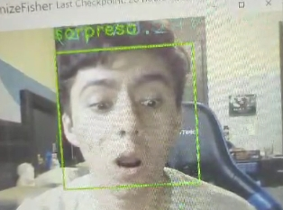
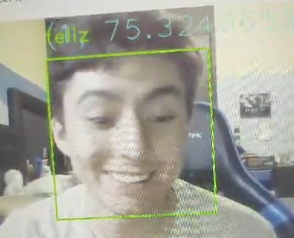

# *Reconocimiento de Emociones*

El reconocimiento de emociones se basa en entrenar un modelo de reconocimiento facial utilizando la biblioteca OpenCV y guardar el archivo XML. El modelo se entrena reconociento un patron en concreto de muchas personas con la misma emocion. Para este ejemplo se hizo una colaboracion entre compañéros el crear un mismo archivo *XML* uniendo nuestros rostros de las emociones

-Feliz
-Enojado
-Serio
-Sorprendido

# Codigo Generado #

Por lo que con el codigo siguiente lee las carpetas de cada compañéro con sus emociones cada uno, por lo que el codigo es:

*import cv2 as cv* 
*import numpy as np* 
*import os*

*dataSet = 'C:\\Users\\Leona\\Documents\\EJ3\\Sentimientos\\Persones'*
*faces  = os.listdir(dataSet)*
*print(faces)*

*labels = []*
*facesData = []*
*label = 0*
*for face in faces:*
*facePath = dataSet+'\\'+face*
*for faceName in os.listdir(facePath):*
*labels.append(label)*
*facesData.append(cv.imread(facePath+'\\'+faceName,0))*
*label = label + 1*
*print(np.count_nonzero(np.array(labels)==0))* 
*faceRecognizer = cv.face.LBPHFaceRecognizer_create()*
*faceRecognizer.train(facesData, np.array(labels))*
*faceRecognizer.write('C:\\Users\\Leona\\Documents\\EJ3\\Sentimientos\\LBPHPersonesFix2.xml')*

*_['Angel', 'Dancy', 'Edgar', 'George', 'Joeeee', 'jonhy', 'Leo', 'LeoC', 'moy', 'Pancho']_*

Una vez ejecutado el codigo, se genera un archivo con el nombre *LBPHPersonesFix2.xml* y ahora vamos al segundo codigo:

import cv2 as cv
import os

*faceRecognizer = cv.face.LBPHFaceRecognizer_create()*
*faceRecognizer.read('C:\\Users\\Leona\\Documents\\EJ3\\Sentimientos\\LBPHPersonesFix2.xml')*
*dataSet = 'C:\\Users\\Leona\\Documents\\EJ3\\Sentimientos\\Persones'*
*faces  = os.listdir(dataSet)*
*cap = cv.VideoCapture(0)*
*rostro = cv.CascadeClassifier('C:\\Users\\Leona\\Downloads\\haarcascade_frontalface_alt.xml')*
*while True:*
*ret, frame = cap.read()*
*if ret == False: break*
*gray = cv.cvtColor(frame, cv.COLOR_BGR2GRAY)*
*cpGray = gray.copy()*
*rostros = rostro.detectMultiScale(gray, 1.3, 3)*
*for(x, y, w, h) in rostros:*
*frame2 = cpGray[y:y+h, x:x+w]*
*frame2 = cv.resize(frame2,  (100,100), interpolation=cv.INTER_CUBIC)*
*result = faceRecognizer.predict(frame2)*
*cv.putText(frame, '{}'.format(result), (x,y-20), 1,3.3, (255,255,0), 1, cv.LINE_AA)*
*if result[1] < 100:*
*cv.putText(frame,'{}'.format(faces[result[0]]),(x,y-25),2,1.1,(0,255,0),1,cv.LINE_AA)*
*cv.rectangle(frame, (x,y),(x+w,y+h),(0,255,0),2)*
*else:*
*cv.putText(frame,'Desconocido',(x,y-20),2,0.8,(0,0,255),1,cv.LINE_AA)*
*cv.rectangle(frame, (x,y),(x+w,y+h),(0,0,255),2)* 
*cv.imshow('frame', frame)*
*k = cv.waitKey(1)*
*if k == 27:*
*break*
*cap.release()*
*cv.destroyAllWindows()*

# Mostrando funcionamiento #

Aqui tenemos 2 ejemplos del funcionamiento con el rostro de nuestro compañéro Jorge Alberto Juarez Rocha

