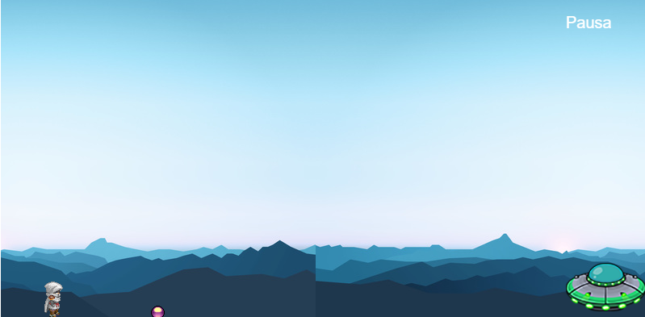
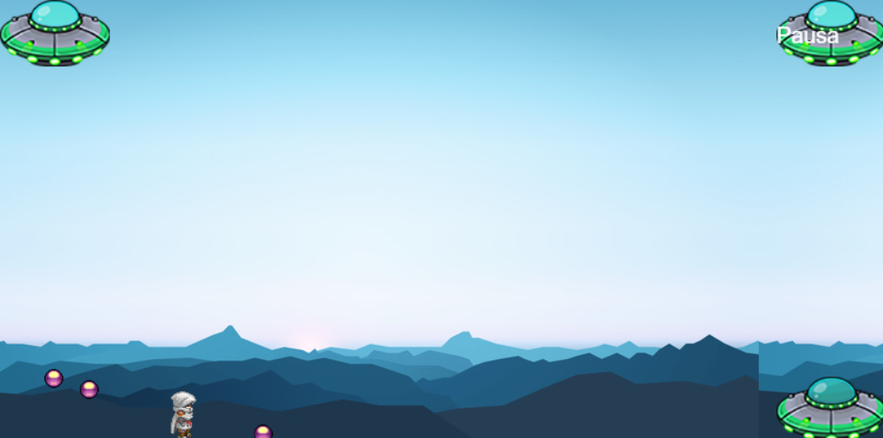

# *Phaser 1 - 3 Balas*

El juego de Phaser es un framework de desarrollo de juego en 2D basado en JavaScript con diferentes variantes, el juego/modelo que se utilizó (almenos el de la clase) se trata de el juego puede saltar o quedarse en el suelo dependiendo si desea esquivar la bala, como en las siguientes imagenes:

Lo que aun mejora el modelo, es que se agrega la biblioteca Synaptic.js para crear y entrenar una red neuronal, lo que tiene 2 tipos de datos (Entrada y Salida) que en base a eso se entrena la red neuronal, aprende de los valores y genera una respuesta.

Este juego ya esta completado para unicamente saltar o quedarse en el suelo dependiendo del aprendizaje por lo valores de Suelo,Aire y Distancia de la bala respecto al jugador.

# Mejorando el Modelo #

Se añadio mas funcionalidad para que sea un mayor reto en el juego que es generar otras 2 balas (3 en total) y añadiendo mas valores a la entrada y salida del arreglo de aprendizaje para la red neuronal:

*Antes*
*Input' :  [despBala , velocidadBala],*
*'output':  [estatusAire, estatuSuelo]* 

*Despues*
*Input' :  [despBala1 , velocidadBala1,despBala2 , velocidadBala2 ,despBala3 , velocidadBala3],*
*'output':  [estatusAire, estatuSuelo, estatusIzquierda, estatusDerecha, estatusQuieto]* 

Como se puede ver, se agregaron muchas mas variables, tanto de entrada como de salida, esto causa una modificacion en la hora de definir la red neuronal:

*Antes*
*nnNetwork =  new synaptic.Architect.Perceptron(2,3,3,2);*

*Despues*
*nnNetwork =  new synaptic.Architect.Perceptron(6,5,5,5);*

Lo que en pocas palabras es:
-6 entradas
-5 neuronas en la primer capa oculta
-5 neuronas en la segunda capa oculta
-5 salidas

Esto define el modo de entrenamiento, al igual la red de entrenamiento:

*function enRedNeural(){*
*nnEntrenamiento.train(datosEntrenamiento, {rate: 0.03, iterations: 10000, shuffle: true});*
*}*

La función anterior inicia el proceso de entrenamiento de la red neuronal utilizando los datos de entrenamiento con una tasa de 0.03 y 10000 iteraciones, estos datos son de manera aleatoria para su aprendizaje.

# Como funciona #

Una vez que se entreno la red neuronal, se llama a la funcion dependiendo de las entradas y las salidas que desea como resultado de esa funcion, lo que se ideo para este nuevo ejercicio es que se crearon funciones:

*Entrada*
-despBala1 , velocidadBala1
-despBala2 , velocidadBala2
-despBala3 , velocidadBala3

*Salida*
-Izquierda o Quieto
-Derecha o Quieto
-Arriba o Suelo

Este es un ejemplo de la función programada, que decide entre si ir a la izquierda o quedarse quieto.

*function datosDeEntrenamiento(param_entrada){*
    *nnSalida = nnNetwork.activate(param_entrada);*
    *var der=Math.round( nnSalida[3]100 );*
    *var qui=Math.round( nnSalida[4]100 );*
    *return nnSalida[3]>=nnSalida[4];*
*}*

Lo que genera mayor complejidad y dificultad en el juego, por lo que viendolo visualmente se ve asi:

Si se desea revisar mas a profundidad el codigo, revise en la carpeta *archivos* y busque la caprte de *Phaser2*

