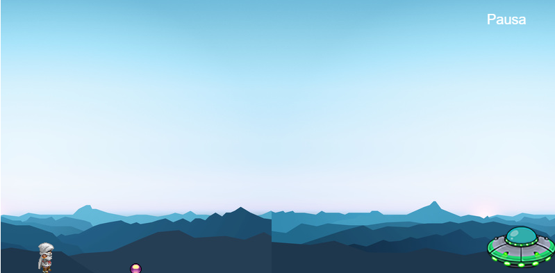
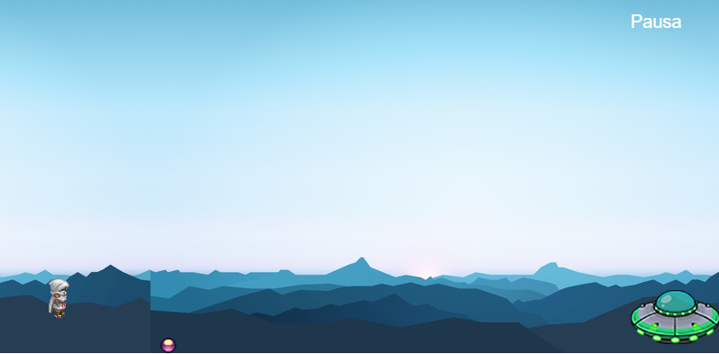
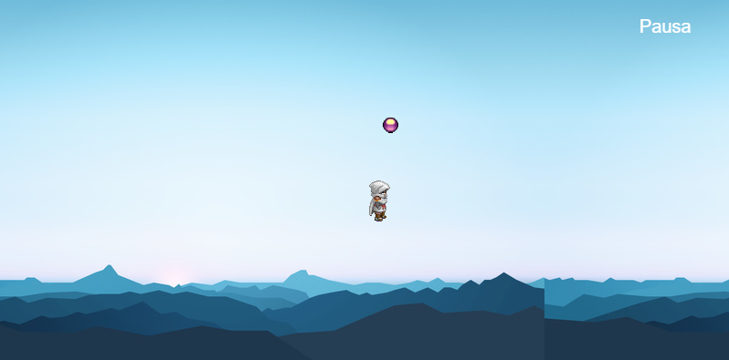
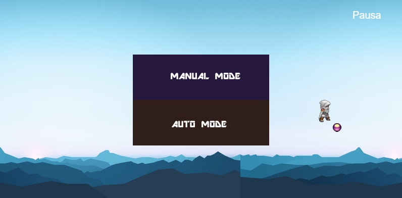

# *Phaser 1 - 3 Balas*

El juego de Phaser es un framework de desarrollo de juego en 2D basado en JavaScript con diferentes variantes, el juego/modelo que se utilizó (almenos el de la clase) se trata de el juego puede saltar o quedarse en el suelo dependiendo si desea esquivar la bala, como en las siguientes imagenes:

Lo que aun mejora el modelo, es que se agrega la biblioteca Synaptic.js para crear y entrenar una red neuronal, lo que tiene 2 tipos de datos (Entrada y Salida) que en base a eso se entrena la red neuronal, aprende de los valores y genera una respuesta.

Este juego ya esta completado para unicamente saltar o quedarse en el suelo dependiendo del aprendizaje por lo valores de Suelo,Aire y Distancia de la bala respecto al jugador.

# Mejorando el Modelo por segunda vez #

Luego de la primera dificultad de 3 balas, se aumenta la dificultad añadiendo aun mas entrada y menos salida, el objetivo es que el jugador ahora debe de esquivar una sola bala que rebota por toda la area definida de juego en donde se puede mover hacia 4 direcciones (Arriba, Abajo, Izquierda, Derecha).

Lo que ocasiona es que el modelo de aprendizaje de la red neuronal cambie:

*Original*
*Input' :  [despBala , velocidadBala],*
*'output':  [estatusAire, estatuSuelo]* 

*Phaser-3balas*
*Input' :  [despBala1 , velocidadBala1,despBala2 , velocidadBala2 ,despBala3 , velocidadBala3],*
*'output':  [estatusAire, estatuSuelo, estatusIzquierda, estatusDerecha, estatusQuieto]* 

*Phaser-3balas*
*Input' :  [dx, dy , distancia],*
*'output':  [estatusIzquierda, estatusDerecha, estatusArriba, estatusAbajo, estatusQuieto]* 

Ahora explicaremos las entradas:

dx : saber las coordenadas en X respecto al jugador
dy : saber las coordenadas en Y respecto al jugador
distancia : formula para medir la distancia euclidiana

*var dx = bala.x - jugador.x;*
*var dy =  jugador.y - bala.y;*
*var distancia = Math.sqrt(dx * dx + dy * dy);*

# Modificación de red neuronal #

Al igual que el modelo anterior, se modifico en la forma como se entrena la red neuronal, tanto extradas, capas ocultas y salidas:

*Original*
*nnNetwork =  new synaptic.Architect.Perceptron(2,3,3,2);*

*Phaser-3balas*
*nnNetwork =  new synaptic.Architect.Perceptron(6,5,5,5);*

*Phaser-3balas*
*nnNetwork =  new synaptic.Architect.Perceptron(3,6,6,6);*

Las diferencias ahora son:
-3 entradas
-6 neuronas en la primer capa oculta
-6 neuronas en la segunda capa oculta
-6 salidas

El modo de entrenamiento sigue siendo igual que el phaser-3balas por lo que el entrenamiento queda :

*function enRedNeural(){*
*nnEntrenamiento.train(datosEntrenamiento, {rate: 0.03, iterations: 10000, shuffle: true});*
*}*

La función anterior inicia el proceso de entrenamiento de la red neuronal utilizando los datos de entrenamiento con una tasa de 0.03 y 10000 iteraciones, estos datos son de manera aleatoria para su aprendizaje.

# Como funciona #

Una vez que se entreno la red neuronal, se llama a la funcion dependiendo de las entradas y las salidas que desea como resultado de esa funcion, lo que se ideo para este nuevo ejercicio es que se crearon funciones:

*Entrada*
- dx
- dy
- distancia

*Salida*
- estatusIzquierda
- estatusDerecha
- estatusArriba
- estatusAbajo
- estatusQuieto

Este es un ejemplo de la función programada, que decide entre si ir a la izquierda o quedarse quieto.

*function datosDeEntrenamiento(param_entrada){*
    *nnSalida = nnNetwork.activate(param_entrada);*
    *var der=Math.round( nnSalida[0]100 );*
    *var qui=Math.round( nnSalida[4]100 );*
    *return nnSalida[0]>=nnSalida[4];*
*}*

Lo que genera mayor complejidad y dificultad en el juego, por lo que viendolo visualmente se ve asi:

Si se desea revisar mas a profundidad el codigo, revise en la carpeta *archivos* y busque la caprte de *Phaser3*

