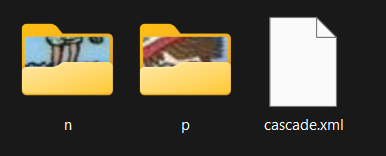

# *Reconocimiento del personaje Wally*

Wally, conocido como Waldo en los Estados Unidos y Canadá, es un personaje de una serie de libros de rompecabezas creada por el ilustrador británico Martin Handford. La serie se titula "¿Dónde está Wally?" ("Where's Wally?" o "Where's Waldo?" en inglés) y se centra en buscar a Wally, un personaje distintivo con un gorro y suéter a rayas rojas y blancas, lentes y pantalones azules, en escenas muy detalladas y abarrotadas de personas y objetos.

En este proyecto se hace con la finalidad que en las imagenes de wally pueda reconocer en donde esta ubicado dicho personaje, es por ello que ocuparemos 2 programas

Jupyter y Cascade-Trainer-GUI

Para entrenar el modelo CNN en Cascade-Trainer-GUI se deben de tener imagenes de tamaño definido, en mi caso se utilizo 28x28 y 2 carpetas con imagenes: Positivas y Negativas

Las imagenes negativas son zonas/personajes que no tienen nada que ver con el modelo que buscamos, esto lo hacemos para evitar falsos postivos.

Las imagenes positivas son imagenes que tienen facciones similares a las que estamos buscando, en este caso a buscar a wally.

En cascade, cargamos la carpeta en donde estan las 2 carpetas de imagenes, asi como el % de cantidad de positivas que pueden estar disponibles y cuantas son negativas.

Una vez terminaod el entrenamiento, nos degenera un .xml de entrenamiento, este sera nuestro modelo de entrenamiento.

Lo siguiente sera abrir el programa de Jupyter con el siguiente codigo:

*import numpy as np*
*import cv2 as cv*

*Cargar el clasificador entrenado*
*face_cascade = cv.CascadeClassifier('c:\\Users\\Leona\\Documents\\EJ3\\Walle\\cascade.xml')*

*Cargar la imagen de Wally*
*img = cv.imread('c:\\Users\\Leona\\Documents\\EJ3\\Walle\\walle1.jpeg')*

*Convertir la imagen a escala de grises*
*gray = cv.cvtColor(img, cv.COLOR_BGR2GRAY)*

*Detectar rostros en la imagen*
*faces = face_cascade.detectMultiScale(gray, scaleFactor=1.01, minNeighbors=420, minSize=(10, 10))*

*Procesar cada rostro detectado*
*for (x, y, w, h) in faces:*
    *Dibujar un rectángulo verde alrededor del rostro detectado*
    *img = cv.rectangle(img, (x, y), (x + w, y + h), (0, 255, 0), 2)*

*Mostrar la imagen con los rostros detectados y los rectángulos*
*cv.imshow('Wally', img)*
*cv.waitKey(0)*
*cv.destroyAllWindows()*

# Lo ultimo #

Por ultimo, se modifican los parametros *faces* y donde carga la imagen *face_cascade* y veremos los siguientes resultados:

# Conclusión #

Se puede tomar como conclusion que depende en que si encuentre a wally o no dependiendo de que tan bien limpiamos las imagenes positivas y en base a que fotografias son, ya que se reconocen patrones que puedan reconocer a *wally*, sin embargo, tambien depende mucho que las imagenes negativas sean las correctas frente a las negativas, para que haya un contraste de diferencia.

